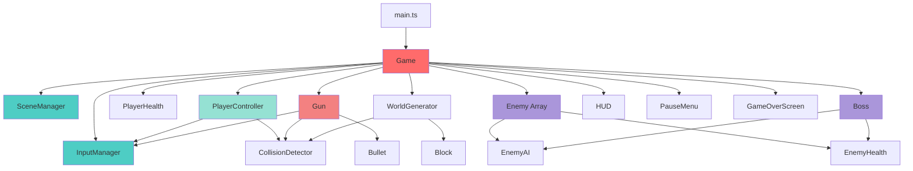
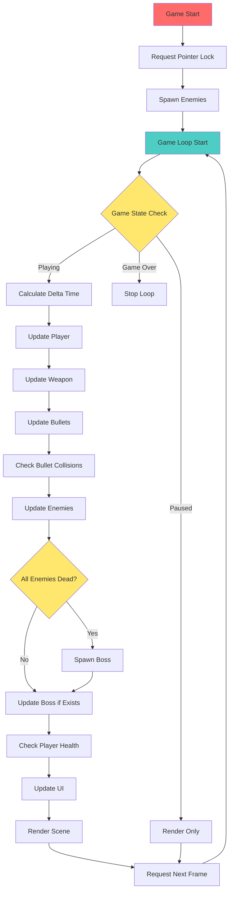
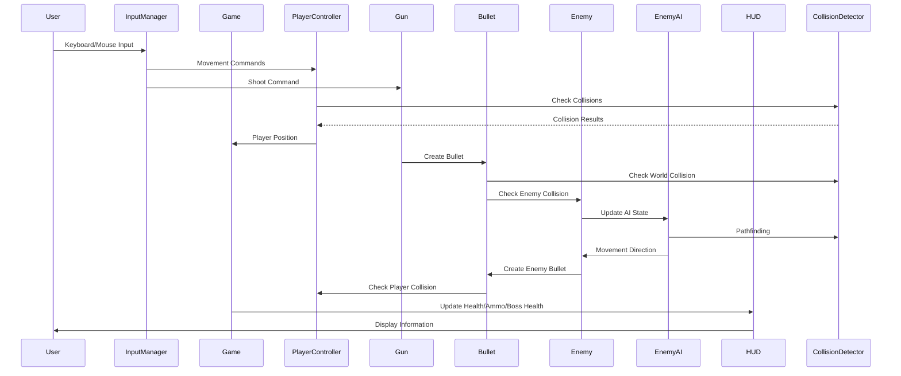
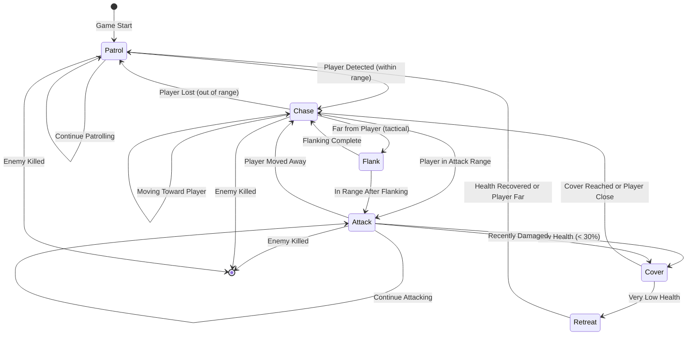

# BlockBlaster

A first-person shooter game with block-style 3D graphics built with Three.js, TypeScript, and Vite. Fight through waves of enemies and defeat the boss in a procedurally generated beach environment with spacecraft wreckage.

## Features

- **First-Person Shooter Gameplay**: Smooth FPS controls with mouse look and WASD movement
- **Block-Style Graphics**: Minecraft-inspired block-based 3D world and characters
- **Advanced Enemy AI**: Enemies with patrol, chase, attack, cover-seeking, and flanking behaviors
- **Boss Battle**: Defeat all enemies to spawn a powerful boss with enhanced abilities
- **Weapon System**: 
  - Magazine-based ammo system (30 rounds per magazine, 3 magazines)
  - Manual reloading (R key)
  - Visible bullet projectiles with physics
  - Muzzle flash effects
  - Camera recoil
- **Health System**: Player and enemy health with visual feedback
- **Level Design**: Procedurally generated beach environment with:
  - Sand terrain and water areas
  - Hills and elevation changes
  - Spacecraft wreckage for cover
  - Strategic cover positions
  - Rocks and debris
- **UI System**:
  - Health bar with gradient colors
  - Ammo counter (current magazine / total magazines)
  - Reload progress indicator
  - Boss health bar
  - Pause menu with adjustable mouse sensitivity
  - Game over screen
- **Performance Optimizations**: 
  - Distance-based enemy updates
  - Bullet pooling (max 50 active bullets)
  - Efficient collision detection

## Controls

- **WASD** - Move (forward, backward, strafe left, strafe right)
- **Mouse** - Look around (first-person camera)
- **Left Click** - Shoot
- **Space** - Jump
- **R** - Reload
- **ESC** - Pause/Resume game

## Setup

### Prerequisites

- Node.js (v18 or higher)
- npm or yarn

### Installation

1. Clone or download this repository
2. Install dependencies:

```bash
npm install
```

3. Start the development server:

```bash
npm run dev
```

4. Open your browser to `http://localhost:3000`

### Build for Production

```bash
npm run build
```

This will create an optimized production build in the `dist/` directory.

### Preview Production Build

```bash
npm run preview
```

## Deployment

The game is a static site and can be deployed to any static hosting service.

### Vercel

1. Install Vercel CLI (if not already installed):
```bash
npm i -g vercel
```

2. Deploy:
```bash
vercel
```

Or connect your GitHub repository to Vercel for automatic deployments.

### Netlify

1. Install Netlify CLI (if not already installed):
```bash
npm i -g netlify-cli
```

2. Build the project:
```bash
npm run build
```

3. Deploy:
```bash
netlify deploy --prod --dir=dist
```

Or connect your GitHub repository to Netlify and set:
- Build command: `npm run build`
- Publish directory: `dist`

### GitHub Pages

1. Build the project:
```bash
npm run build
```

2. Push the `dist` folder contents to the `gh-pages` branch, or use a GitHub Action to automate this.

## Project Structure

```
Game_Test/
├── src/
│   ├── main.ts              # Entry point
│   ├── core/                # Core game systems
│   │   ├── Game.ts          # Main game loop and state management
│   │   ├── SceneManager.ts  # Three.js scene setup
│   │   └── InputManager.ts  # Input handling (keyboard, mouse, pointer lock)
│   ├── player/              # Player systems
│   │   ├── PlayerController.ts  # Movement, camera, physics
│   │   └── PlayerHealth.ts      # Health management
│   ├── weapon/              # Weapon systems
│   │   ├── Weapon.ts        # Base weapon class
│   │   ├── Gun.ts           # Gun implementation with ammo system
│   │   └── Bullet.ts        # Bullet physics and collision
│   ├── enemy/               # Enemy systems
│   │   ├── Enemy.ts         # Enemy entity
│   │   ├── EnemyAI.ts       # AI state machine and behaviors
│   │   ├── EnemyHealth.ts   # Enemy health system
│   │   └── Boss.ts          # Boss enemy with enhanced stats
│   ├── world/               # World generation
│   │   ├── WorldGenerator.ts    # Procedural level generation
│   │   ├── Block.ts             # Block creation utilities
│   │   └── CollisionDetector.ts # AABB collision detection
│   ├── ui/                  # User interface
│   │   ├── HUD.ts           # Health, ammo, boss health display
│   │   ├── PauseMenu.ts     # Pause menu with settings
│   │   └── GameOverScreen.ts # Game over screen
│   ├── utils/               # Utilities
│   │   ├── constants.ts     # Game configuration constants
│   │   └── math.ts          # Math utilities
│   └── types/               # TypeScript types
│       └── index.ts
├── index.html
├── package.json
├── tsconfig.json
└── vite.config.ts
```

## How It Works

### Game Architecture

The game follows a modular architecture where each system is responsible for a specific aspect of gameplay:



### Game Loop Flow

The main game loop runs at 60 FPS using `requestAnimationFrame`:



### Information Flow

Data flows between systems during gameplay:



### Enemy AI State Machine

Enemies use a sophisticated state machine with multiple behaviors:



### Core Systems

#### Game Loop
- Uses `requestAnimationFrame` for smooth 60 FPS rendering
- Delta time calculation for frame-independent updates
- State management (playing, paused, game over)
- Performance optimizations (distance-based enemy updates, bullet limits)

#### Scene Management
- Three.js scene with lighting, shadows, and fog
- Camera setup (first-person perspective)
- Render loop with proper cleanup

#### Input Handling
- Keyboard input (WASD, Space, R, ESC)
- Mouse input with pointer lock for FPS controls
- Mouse sensitivity adjustment (saved to localStorage)
- Input state tracking

#### Player System
- **Movement**: Velocity-based physics with gravity and ground collision
- **Camera**: First-person perspective with mouse look (pitch/yaw)
- **Jumping**: Jump mechanics with bouncy camera animation
- **Collision**: AABB collision detection with world blocks
- **Health**: Health system with damage cooldown (500ms)

#### Weapon System
- **Shooting**: Projectile-based bullets with physics
- **Ammo System**: 
  - 30 rounds per magazine
  - 3 magazines total
  - Manual reload (R key) or auto-reload when empty
  - 2-second reload time
- **Visual Effects**: 
  - Muzzle flash using PointLight
  - Camera recoil animation
  - Visible bullet projectiles
- **Hit Detection**: 
  - Bullet collision with enemies and world
  - Separate collision for player and enemy bullets

#### Enemy System
- **AI States**: 
  - **Patrol**: Random waypoint navigation with obstacle avoidance
  - **Chase**: Follows player when in detection range (15 units)
  - **Attack**: Attacks player when in range (8 units)
  - **Cover**: Seeks cover when low health or recently damaged
  - **Flank**: Approaches from angles instead of directly
  - **Retreat**: Moves away when very low health
- **Behaviors**:
  - Line of sight checking before attacking
  - Predictive aiming (leads moving targets)
  - Obstacle avoidance during movement
  - Health-based decision making
- **Block Models**: Procedurally generated block-style 3D models
- **Health**: Enemy health system with damage feedback
- **Shooting**: Enemies can shoot bullets at the player

#### Boss System
- Spawns when all regular enemies are defeated
- Enhanced stats:
  - 200 health (vs 50 for regular enemies)
  - Faster movement and attack speed
  - Longer detection and attack ranges
  - Higher damage output
- Same AI behaviors as regular enemies but more aggressive

#### World System
- **Level Generation**: Procedurally generates beach environment
  - Sand terrain with water areas
  - Hills using sine wave height maps
  - Spacecraft wreckage pieces
  - Rocks and debris for cover
  - Strategic cover positions
- **Collision Detection**: AABB (Axis-Aligned Bounding Box) collision detection
- **Blocks**: Various block types (sand, water, metal, rock) with different colors

#### UI System
- **HUD**: 
  - Health bar with gradient (red to green)
  - Ammo counter (current / magazines)
  - Reload progress indicator
  - Boss health bar (when boss is active)
  - Crosshair
- **Pause Menu**: 
  - Adjustable mouse sensitivity (0.001 - 0.005)
  - Settings saved to localStorage
  - Resume functionality
- **Game Over Screen**: 
  - Displayed when player health reaches 0
  - Restart button

## Game Configuration

Key game constants can be adjusted in `src/utils/constants.ts`:

- **Player**: Speed, jump force, gravity, health, size
- **Weapon**: Fire rate, damage, range, ammo, bullet speed
- **Enemy**: Health, speed, detection/attack ranges, damage, cooldowns
- **Boss**: Enhanced versions of enemy stats
- **World**: Block size, ground size, grid size
- **Performance**: Shadow map size, fog settings

## Extending the Game

### Adding New Weapons

1. Create a new weapon class extending `Weapon.ts`
2. Implement the `update()` and `reset()` methods
3. Add weapon switching logic in `Game.ts`
4. Update HUD to display weapon-specific information

### Adding New Enemy Types

1. Create a new enemy class or extend `Enemy.ts`
2. Customize the model in `createEnemyModel()`
3. Adjust AI behavior in `EnemyAI.ts` if needed
4. Add new enemy type to spawn logic in `Game.ts`

### Adding New Levels

1. Modify `WorldGenerator.ts` to create different level layouts
2. Add new block types in `Block.ts`
3. Adjust spawn points and obstacles
4. Create new terrain generation functions

### Adding Sound Effects

1. Add audio files to `public/` directory
2. Use Web Audio API or HTML5 Audio in weapon/enemy systems
3. Play sounds on events (shoot, hit, enemy death, reload, etc.)

### Adding Power-ups

1. Create a power-up class with position and type
2. Add collision detection with player
3. Implement effects (health boost, ammo refill, speed boost, etc.)
4. Spawn power-ups in world or drop from enemies

## Performance

The game is optimized for 60 FPS on modern browsers:

- **Efficient Collision Detection**: AABB collision with spatial optimization
- **Distance-Based Updates**: Enemies only update within 50 units of player
- **Bullet Pooling**: Maximum 50 active bullets (oldest removed first)
- **Shadow Map Optimization**: Configurable shadow map size
- **Frustum Culling**: Handled automatically by Three.js
- **Object Management**: Proper cleanup of removed entities

## Browser Compatibility

- Chrome/Edge (recommended)
- Firefox
- Safari

Requires WebGL support and Pointer Lock API.

## License

This project is open source and available for educational purposes.

## Credits

Built with:
- [Three.js](https://threejs.org/) - 3D graphics library
- [TypeScript](https://www.typescriptlang.org/) - Type-safe JavaScript
- [Vite](https://vitejs.dev/) - Build tool and dev server
